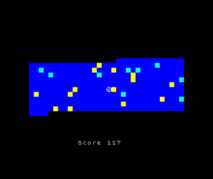

# Bolalela 4 - a commented source

[This game by Beyker Soft](https://bunsen.itch.io/bolalela-4-by-beyker-soft) was an intriguing entry into the [Basic 10Liner competition 2021](https://gkanold.wixsite.com/homeputerium/results-2021).
Somehow it achieves a feat normally impossible in Sinclair BASIC: scrolling an entire playfield both vertically and horizontally with playable performance.

[](https://bunsen.itch.io/bolalela-4-by-beyker-soft)

It's quite obfuscated, but the main trick here is to manipulate the Sinclair BASIC interpreter's function processing (DEF FN) to fast copy some fake string variables, which are in fact pointed at the screen attribute memory.

Typically entries into the 10Liner competition tend to post an accompanying program explanation, but this game did not have one... until now.

This commented listing can be built by [zmakebas](https://github.com/ohnosec/zmakebas) into a functionally identical Spectrum listing to the original, though no longer a ten-liner.

```bash
zmakebas -n "BOLA 4" -o "BOLALELA4.tap" -l -i 10 -a 10 "bolalela4.bas"
```
